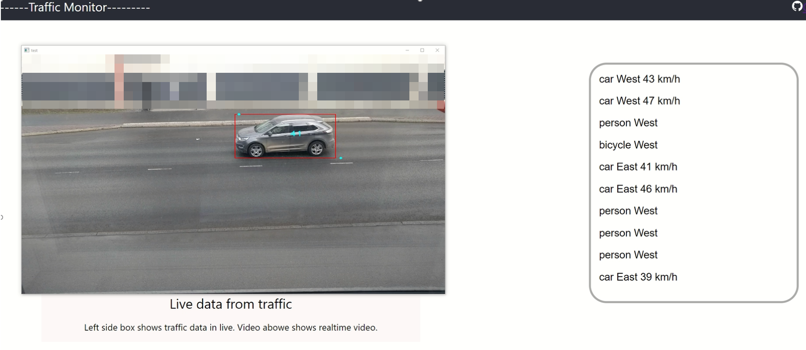
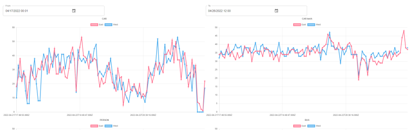

# Traffic monitor

## Info
This project takes live feed from webcam and calculates how many of different means of transportation goes across the webcam feed. 
From these are taken time, direction (west, east) and from cars also speed is estimated.

Frameworks and libraries

MonitorApp
```
-PyTorch
-Yolo5 - model detection
-NorFair - object tracking
```
WebApp
```
-Express - backend
-React - frontend
````



*Picture of webcam view and webpage live updating data table (no live video on website at this moment)*

## Monitoring app

Monitoring app (app.py) takes in webcam feed and uses pretrained Yolo5 model to detect Cars, Persons, Busses, Bicycles, Dogs, Trucks, Motorcycles. Detections are fed to NorFair object tracking. From tracked objects are monitored object's direction and time and if it has passed counting line. Confirmed objects are send to server in different thread in set intervals.
```
[{
    "class_name" : "car",
    "direction" : "west",
    "speed" : 50,
    "time" : "2022-04-03 14:14:23"
}]
```


### Speed estimation
Speed is estimated by taking the first 100 cars lengths in pixel on each lane. Average of cars length in pixel is converted to meters using average car length of 4.5 meters. Then speed is calculated from the first positions x-coordinate and timestamp and last positions x-coordinate and timestamp. Speeds are not accurate but are comparable to each other.


## Server
Live updates are kept in memory and in set intervals (10 minutes) live update list is cleared and data is parsed to cleaner time frames and saved to database.

```
{
    "car": {
    "west": 26,
    "east": 30,
    "speed_west": "34",
    "speed_east": "31"
    },
    "person": {
    "west": 10,
    "east": 3
    },
    "bus": {
    "west": 0,
    "east": 0
    },
    "truck": {
    "west": 1,
    "east": 1
    },
    "bicycle": {
    "west": 1,
    "east": 1
    },
    "dog": {
    "west": 0,
    "east": 0
    },
    "motorcycle": {
    "west": 0,
    "east": 0
    },
    "time": "2022-04-12T15:49:50.000Z"
}
```
*Example of one 10-minute time frame data number is number of detections*

Server supports three filtering query parameters.
```
From -start time of
To  -end of time
object  -get only data of one object (car,bus...)
```


## Client

Client includes live updating table and charts. Chart data can be searched by time.

  
*Charts on webpage*


## Contributors
-t9syje PostgreSQL tables, CSS,Planning, UI desing.


## Deploy
- Work in process...